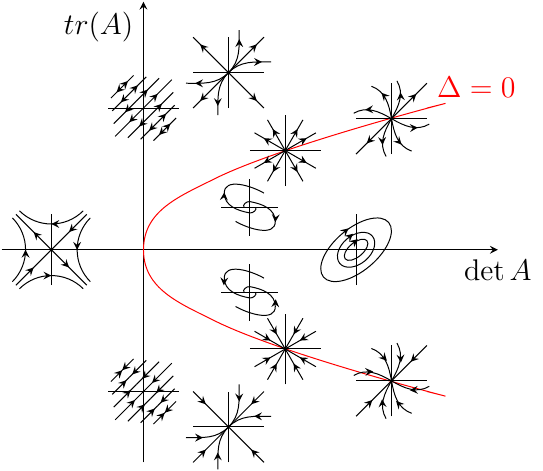

The code is 


\usetikzlibrary{calc,intersections,positioning,arrows,decorations.markings,decorations.pathreplacing}
\begin{tikzpicture}
\draw[-stealth] (-2,0) -- (5,0) node[below] {$\det A$};
\draw[-stealth] (0,-3)--(0,3.5) node[below left]{$tr(A)$};
\draw[red] (0,0) to[out=90,in=206.6] (1,1) to[out=26.6,in=14] (4,2) node[above right]{$\Delta=0$};
\draw[red] (0,0) to[out=270,in=153.4] (1,-1) to[out=-26.6,in=-14] (4,-2);
% helix
\begin{scope}[xshift=1.5cm,yshift=0.6cm,scale=0.4,decoration={markings,mark=at position 0.5 with{\arrow{stealth}}}]
\draw (-1,0)--(1,0);
\draw (0,-1)--(0,1);
\foreach \i in {0,180} {
\begin{scope}[rotate=\i]
\draw[postaction={decorate}] (0.2,0) to[out=-45,in=350] (0,-0.2) to[out=170,in=270] (-0.9,0.5) to[out=90,in=150] (0.5,0.5);
\end{scope}
}
\end{scope}
% helix
\begin{scope}[xshift=1.5cm,yshift=-0.6cm,scale=0.4,decoration={markings,mark=at position 0.5 with{\arrow{stealth reversed}}}]
\draw (-1,0)--(1,0);
\draw (0,-1)--(0,1);
\foreach \i in {0,180} {
\begin{scope}[rotate=\i]
\draw[postaction={decorate}] (0.2,0) to[out=-45,in=350] (0,-0.2) to[out=170,in=270] (-0.9,0.5) to[out=90,in=150] (0.5,0.5);
\end{scope}
}
\end{scope}
% center
\begin{scope}[xshift=3cm,yshift=0cm,scale=0.05,decoration={markings,mark=at position 0.5 with{\arrow{stealth reversed}}}]
\draw (-1,0)--(1,0);
\draw (0,-1)--(0,1);
\begin{scope}[rotate=-50]
\draw[postaction={decorate}] (0,0) circle(2 and 4);
\draw[postaction={decorate}] (0,0) circle(4 and 6);
\draw[postaction={decorate}] (0,0) circle(6 and 2);
\end{scope}
\end{scope}
% unstable node
\begin{scope}[xshift=1.2cm,yshift=2.5cm,scale=0.5,decoration={markings,mark=at position 0.8 with{\arrow{stealth}}}]
\draw (-1,0)--(1,0);
\draw (0,-1)--(0,1);
\foreach \i in {0,180} {
\begin{scope}[rotate=\i]
\draw[postaction={decorate}] (0,0)  -- (1,1);
\draw[postaction={decorate}] (0,0) to[out=45,in=180] (1.2,0.3);
\draw[postaction={decorate}] (0,0) to[out=45,in=270] (0.3,1.2);
\draw[postaction={decorate}] (0,0) -- (-1,1);
\end{scope}
}
\end{scope}
% stable node
\begin{scope}[xshift=1.2cm,yshift=-2.5cm,scale=0.5,decoration={markings,mark=at position 0.8 with{\arrow{stealth reversed}}}]
\draw (-1,0)--(1,0);
\draw (0,-1)--(0,1);
\foreach \i in {0,180} {
\begin{scope}[rotate=\i]
\draw[postaction={decorate}] (0,0)  -- (1,1);
\draw[postaction={decorate}] (0,0) to[out=45,in=180] (1.2,0.3);
\draw[postaction={decorate}] (0,0) to[out=45,in=270] (0.3,1.2);
\draw[postaction={decorate}] (0,0) -- (-1,1);
\end{scope}
}
\end{scope}
% unstable star node
\begin{scope}[xshift=2cm,yshift=1.4cm,scale=0.5,decoration={markings,mark=at position 0.7 with{\arrow{stealth}}}]
\draw (-1,0)--(1,0);
\draw (0,-1)--(0,1);
\foreach \i in {30,60,120,150,210,240,300,330} {
	\begin{scope}[rotate=\i]
	\draw[postaction={decorate}] (0,0) -- (1,0);
	\end{scope}
}
\end{scope}
% stable star node
\begin{scope}[xshift=2cm,yshift=-1.4cm,scale=0.5,decoration={markings,mark=at position 0.7 with{\arrow{stealth reversed}}}]
\draw (-1,0)--(1,0);
\draw (0,-1)--(0,1);
\foreach \i in {30,60,120,150,210,240,300,330} {
	\begin{scope}[rotate=\i]
	\draw[postaction={decorate}] (0,0) -- (1,0);
	\end{scope}
}
\end{scope}
% unstable  node
\begin{scope}[xshift=3.5cm,yshift=1.85cm,scale=0.5,decoration={markings,mark=at position 0.7 with{\arrow{stealth}}}]
\draw (-1,0)--(1,0);
\draw (0,-1)--(0,1);
\draw[postaction={decorate}] (0,0) -- (1,1);
\draw[postaction={decorate}] (0,0) -- (-1,-1);
\foreach \i in {60,100,150,240,280,330} {
\begin{scope}[rotate=\i]
\draw[postaction={decorate}] (0,0) to[out=0, in=240] (1,0.4);
\end{scope}
}
\end{scope}
% stable  node
\begin{scope}[xshift=3.5cm,yshift=-1.85cm,scale=0.5,decoration={markings,mark=at position 0.7 with{\arrow{stealth reversed}}}]
\draw (-1,0)--(1,0);
\draw (0,-1)--(0,1);
\draw[postaction={decorate}] (0,0) -- (1,1);
\draw[postaction={decorate}] (0,0) -- (-1,-1);
\foreach \i in {60,100,150,240,280,330} {
\begin{scope}[rotate=\i]
\draw[postaction={decorate}] (0,0) to[out=0, in=240] (1,0.4);
\end{scope}
}
\end{scope}
% degenerate
\begin{scope}[xshift=0cm,yshift=2cm,scale=0.5,decoration={markings,mark=at position 0.5 with{\arrow{stealth}}}]
\draw (-1,0)--(1,0);
\draw (0,-1)--(0,1);
\foreach \i in {0.2,0.4,0.6,0,-0.2,-0.4,-0.6} {
\pgfmathsetmacro\Scale{1-abs(\i)}
\begin{scope}[xshift=\i cm,yshift=-\i cm,scale=\Scale]
\draw[postaction={decorate}] (0,0) -- (0.8,0.8);
\draw[postaction={decorate}] (0,0) -- (-0.8,-0.8);
\end{scope}
}
\end{scope}
% degenerate
\begin{scope}[xshift=0cm,yshift=-2cm,scale=0.5,decoration={markings,mark=at position 0.5 with{\arrow{stealth reversed}}}]
\draw (-1,0)--(1,0);
\draw (0,-1)--(0,1);
\foreach \i in {0.2,0.4,0.6,0,-0.2,-0.4,-0.6} {
\pgfmathsetmacro\Scale{1-abs(\i)}
\begin{scope}[xshift=\i cm,yshift=-\i cm,scale=\Scale]
\draw[postaction={decorate}] (0,0) -- (0.8,0.8);
\draw[postaction={decorate}] (0,0) -- (-0.8,-0.8);
\end{scope}
}
\end{scope}
% saddle
\begin{scope}[xshift=-1.3cm,yshift=0cm,scale=0.5,decoration={markings,mark=at position 0.5 with{\arrow{stealth}}}]
\draw (-1,0)--(1,0);
\draw (0,-1)--(0,1);
\foreach \i in {0,180} {
\begin{scope}[rotate=\i]
\draw[postaction={decorate}] (1.1,0.9) to[out=225,in=135] (1.1,-0.9);
\draw[postaction={decorate}] (0.9,1.1) to[out=225,in=-45] (-0.9,1.1);
\draw[postaction={decorate}] (1,1) -- (0,0);
\draw[postaction={decorate}] (0,0) -- (-1,1) ;
\end{scope}
}
\end{scope}
\end{tikzpicture}


After exporting from `ktikz`, the result is 

The result is satisfying, however, it takes me a lot of time to adjust the coordinates. Maybe using parameterized curve will be a better choice.

The main point in this example is to use `\draw (P0) to[out=angle1, in=angle2] (P1)` syntax to draw any smooth curves with tangent angle at each control point. `angle1` means tangent algle of curve `P0-P1` at point `P0` pointing to `P1`, and `angle2` means tangent angle at `P1` pointing to `P0`.

And one lesson from this example is that you should always use big enough(or normal) coordinates to draw curves(e.g. circles) and then scale it to smaller one as required when you use decoration.

