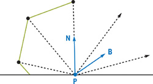
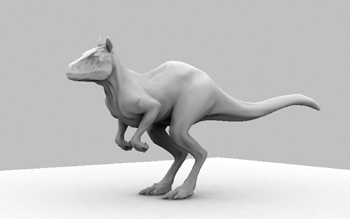
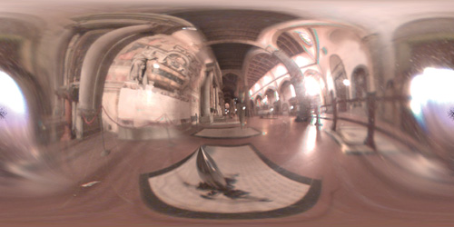
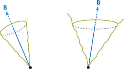
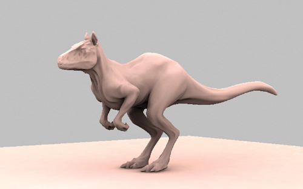

[**Source**](http://http.developer.nvidia.com/GPUGems/gpugems_ch17.html)

Matt Pharr

NVIDIA

Simon Green

NVIDIA

本文中翻译所涉及到的词汇:

  * ambient occlusion: 环境光遮蔽
  * occlusion: 单独情况下翻译成遮挡
  * map: 映射
  * environment map: 环境映射
  * shadown: 阴影
  * shading: 阴影，阴影计算。
  * shading model: 光照模型
  * specular reflection: 镜面反射
  * glossy surface: 光滑表面(并不一定是镜面)
  * diffuse surface: 漫反射表面
  * spherical harmonics: 球谐
  * diffuse: 漫反射
  * accessibility: 可见性。虽然字面上是可访问性，但是意义上更接近可见性，即visibility。
  * mesh: 网格
  * accumulation buffer: 累积缓冲区
  * light: 光源
  * lighting: 光照
  * illumination: 光照

近来，实时计算机图形学社区开始尝试通过复杂的环境光映射来获得具有真实感的光照，而不再是传统的少数几个简单光源。在真实世界里，光实际上是从不同的角度照射到表面上的，而不仅仅是几个点光源或方向光源，这种假设会显著影响视觉效果。人们开发了很多技术来捕捉真实世界中的光照（比如电影中），使得渲染出的光照看起来像是出自于真实环境一样，这样相似性使得图形学可以和真实的场景无缝集成。对于完全合成的场景，可利用场景的环境映射来给场景内的角色或对象增加光照，从而改善渲染结果的真实感。它们不光是用映射处理镜面反射，还用于计算光滑和漫反射表面的光照。

本章描述了一种简单的实时计算环境光的技术。此技术仅限于散射表面，但已经完全满足实时用途。此外，这个方法可以准确表达阴影，因为在计算每个顶点上的阴影时考虑到了遮挡的几何体。虽然，相比于最新研究成果中复杂的方法，此技术得到的阴影值仍存在很多偏差，但是它的优点是非常容易实现。（它可以实现一个可用的光照模拟，至少你不需要理解和实现球谐软件库！）本文方法在很多情形下的结果都不错，而且可以在现代的硬件平台上交互式运行。

此方法基于一种视点无关的预处理过程，即用一个光线跟踪器来计算遮挡信息，然后用这些信息实时快速模拟环境中的漫反射阴影。这个技术最初由Hayden Landis(2002)和他在Industrial Light & Magical的同事开发；它已经被用于ILM公司的许多产品中（用的是非实时渲染器）。

## 17.1 概述
我们在这里所说的环境光技术已经命名为__环境光遮蔽__光照。想象这个方法的一种方式是模型表面上有一个"聪明"的环境光项，它的值随着外部环境的可见程度来决定。另外一种方式是，可以将其视为一种散射项，它有效表达入射光线的复杂分布情况。在这一章里，我们将坚持第二种理解方式。

这个技术背后的基本思想是，如果我们预处理一个模型，计算每个点上看外部环境的情况（而不是计算外部环境被遮挡的情况），然后，我们在渲染时使用这个信息来计算散射光照项。渲染的结果是，模型的缝隙中的部分显得更暗，而暴露的部分接受了更多的光照因而显得更亮。这种结果显然比传统的标准光照模型更具有真实感。

这个方法还可以扩展为使用环境光作为光照来源，即表达所有方向的入射光线的环境映射可用于决定对象上每点的光照颜色值。为实现这一点，除了要记录模型上每点的外部环境可见性，还要记录最大光照来源方向。这两个量有效地定义了一个面向场景的未被遮挡的锥体，从而可以从环境映射中获得一个非常模糊的查找，然后从顶点的这个感兴趣方向锥体模拟出总体的入射光照情况。

## 17.2 预处理过程
给定一个任意的模型，本技术需要知道模型上每个顶点上的两个量：

  - "可见性(accessibility)"：顶点上的半球的哪些部分未被模型的其它部位遮挡
  - 未遮挡入射光线的平均方向

图17-1在2维情况下表示了这两个量。给定一个表面上的点$p$，法向量是$\mathbf{N}$，图中差不多2/3的半球区域被场景中其它几何体遮挡，而只有约1/3未被遮挡。平均入射光线方向表示为$\mathbf{B}$，位于法向量$\mathbf{N}$的右边。不严格地讲，$p$点处的平均入射光线的颜色可以由平均入射方向$\mathbf{B}$周围的锥体平均而得到。

图17-1 计算可见性和平均方向

$\mathbf{B}$向量和可见性值，只依赖于模型而不依赖于光照环境，因此可以使用一个光线追踪器在预处理阶段进行离线计算。在本章中的例子中，我们使用的模型是有精细网格的，因此我们计算每个三角形中心的值，然后，顶点处存储相邻三角形的平均值。然后，我们将这些顶点上的值传递给顶点着色器，以便在片元着色器中用于计算像元。另一种方式是将它们存储于纹理映射中，如果网格比较稀疏时，这种方式更好一些。

列表17-1中的伪代码表达了我们的方法的基本思想。在每个三角形中心，我们在法向量周围的半球上生成一系列的光线，沿着这些光线追踪到场景中去，记录是否与模型相交--这表示从这个方向是否会接收到环境光。然后，我们计算出未遮挡光线的平均方向，这给出了入射光线平均方向的近似值。（当然，平均方向本身可能就是被遮挡的方向，这种情况在此不予考虑）

**列表17-1. 计算环境光遮蔽相关数值的基本算法**


For each triangle {
    Compute center of triangle
    Generate set of raysover the hemisphere there
    Vector avgUnoccluded = Vector(0,0,0);
    int numUnoccluded = 0;
    For each ray {
        If (ray doesn't intersect anything) {
            avgUnoccluded += ray.direction;
            ++numUnoccluded;
        }
    }
    avgUnoccluded = normalize(avgUnoccluded);
    accessibility = numUnoccluded / numRays;
}


一种产生这些光线的简单方法是用__拒绝采样法(rejection sampling)__：在3维立方体(x,y,z轴上-1到1)内随机生成光线，然后拒绝那些不在法向量所决定的单元半球内的光线。通过这个测试的方向满足所需的光线分布。这个方法由列表17-2中的伪代码给出。更复杂的蒙特卡罗(Mante Carlo)采样算法可以保证得到分布更好的采样方向。

**列表17-2. 用拒绝采样法计算随机方向的算法**


while(true) {
    // random float between -1 and 1
    x = RandomFloat(-1,1); 
    y = RandomFloat(-1,1);
    z = RandomFloat(-1,1);
    //ignore ones outside unit sphere
    if(x*x + y*y + z*z > 1) continue; 
    // ignore "down" directions
    if(dot(Vector(x,y,z), N) < 0) continue;
    //success
    return normalize(Vector(x,y,z)); 
}


## 17.3 遮挡计算的硬件加速

用显卡硬件替代软件光线追踪，来加速遮挡信息的计算是可行的。阴影映射提供了一种快速的图像空间方法，可决定一个点是否处于阴影中。(Geforce FX有特殊的硬件支持，可以以很快的速度光栅化阴影映射所需的深度图像。) 与其从表面上每个顶点发出光线，我们不如把问题反过来，将对象暴露在大量的球面光源阵列中，这些光源都是经过了阴影映射的。表面上每一点的遮挡量可以简单地从每个光源的阴影贡献平均获得。我们可以使用一个浮点累积缓存来计算这个平均值。对于$n$个光源来说，我们将场景绘制$n$次，每次将阴影投射的那个光源移动到球面上不同的位置上。我们累积这些黑白图片形成最终的遮挡图片。在足够精细的情况下，这种方法可以模拟覆盖天空大块区域的面光源。

好的结果需要大量的光源(128到1024个)，但是现代图形硬件的性能决定了这种技术仍然比光线追踪快。光源在球面上的分布也会影响到最后结果的质量。最明显的方法是使用极坐标，让光源延经纬度均匀分布，但这会使得两极集中了太多样本。因此，应该使用一种球面上的均匀分布。如果对象位于地平面上，完整的球面光源是没有必要的，一个圆顶或是半球就足够了。

另外一个影响最终结果的质量的问题是阴影映射的走样。这种情况通常出现在由亮转暗的过渡表面上，表现为条纹(steaking)。这个问题可以通过在阴影项上乘以一个法向量和光线方向的函数来缓解，以保证背离光线的表面始终是黑的。

这个方法的一个缺点是对于每个光源来说，都需要两遍计算：第一遍生成阴影映射，第二遍渲染场景阴影，另外累积图像也是有开销的。$n$个光源意味着$2n$遍计算。如果能够在一遍中累积多个阴影映射效果，速度应该会快一些。因为当前的硬件支持8个纹理坐标集合，因此可以在同一遍中同时累积8个阴影。即总共只需要对场景渲染$n+n/8$次。

这个方法还可以扩展，用于计算平均未遮挡方向(又称为弯曲法向量bent normal)。我们可以使用一个着色器来计算光源的方向，乘以阴影值，然后再存为RGB输出颜色。遮挡信息可以存于alpha通道中。而RGB法向量值可以以同样的方式累积起来，然后标准化最后的结果，从而得到平均未遮挡法向量。注意，半个(16比特)浮点累积缓冲区可能没有足够的精度来存储这些矢量的和。

到目前为止，我们提到的技术在摄像机空间中生成遮挡图像，但是通常我们希望生成存储遮挡信息的纹理。如果我们使用的对象拥有唯一的纹理坐标(即纹理覆盖了整个表面，且没有重叠)，那么事情就相对简单了。我们可以用一个顶点着色器将模型展开，使用UV纹理坐标作为屏幕空间位置。这个计算过程按正常的流程进行，但是并非正常地渲染对象本身，而渲染呈方形的被展开的网格。一旦遮挡纹理生成了，它可用于实时的渲染中，本章下面的内容会解释这个渲染过程。

## 17.4 使用环境光遮蔽映射来渲染

以平面上的一个复杂模型为例，我们将采用这个方法(场景中没有纹理，以便更清晰地看到此方法的效果。而且把纹理加到这个技术中去也不是难事)。 每个三角形我们使用512条光线来计算可见性值和平均未遮挡方向，三角形总数为150000个，在一台AMD Athlon 1800XP的机器上使用软件光线追踪耗时约4分钟。然后，将计算结果存于磁盘上，以便我们的演示程序使用。作为对比，图17-2给出了基于一个点光源的简单漫反射光照模型得到的渲染结果，没有阴影。注意，这种传统的图形学方法缺乏真实感，且缺乏复杂的光照信息。比如，该生物底部和大腿内部都显得太亮。

图17-2. 简单漫反射射光照模型的渲染结果

在图17-3中，模型上每点处的颜色为其可见性(由光线追踪预处理得到)。注意，腿部下面的部位要比暴露部位(比如背部)要暗，其背部几乎完全曝光了。图17-2中的由亮变暗的粗糙过渡是由于变化的表面法向量相对于点光源的位置被平滑掉了，得到一个具有真实感的"阴暗的天空光"效果。在平面上生物的下面有一个淡淡的阴影，这是由于生物的身体减少了到达平面的光线所致。

图17-3. 使用可见性信息的渲染结果

阴影有助于显示模型的的站立效果，显示它站在一个地面上，而不是浮在空中，这种错觉可能会在图17-2中出现。

最重要的是，使用可见性值的阴影计算甚至都不需要高级的可编程图形硬件；它可以使用过时的图形硬件，只需要给模型每个顶点传递合适的颜色值即可。因此，它可以以峰值速度运行在众多不同结构的GPU上。如果这个模型有散射纹理映射，我只需要使用可见性值乘以纹理值即可。

### 17.4.1 环境光照

如果可编程图形硬件可用，利用可见性信息，我们可以以一种更复杂的方式生成更复杂的阴影效果。在这里，我们近似计算一个模型在一个复杂真实环境内部会的光照情况，利用到了场景的环境映射中提供的光照信息。在这个例子中，我们使用位于佛罗伦萨的伽利略坟墓的环境映射，如图17-4所示。

图17-4. 伽利略坟墓的环境映射，经纬映射格式

这个环境映射与立方体映射或球状映射的参数化都不相同，后两者被广泛用于交互式图形学中。这种环境映射被称为经纬映射(lat-long map)，之所以叫经纬(latitude-longitude)，是因为其参数化与用经纬网描述地球相似，其中$\theta\in[0,\pi]$，延垂直方向，$\phi\in[0,2\pi)$，延水平方向，$x=\sin\theta\cos\phi$，$y=\sin\theta\sin\phi$，$z=\cos\phi$。给定一个方向$(x,y,z)$，反向求解可得到$(\phi,\theta)$值，这又可以映射到纹理坐标中（除以$(2\pi,\pi)$）。我们使用这种环境映射，因为它支持极端模糊的查找，而没有走样。遗憾的是，模糊立方体映射查找表虽然覆盖了立方体的多个面，但是无法在当前的硬件中正确处理。

使用此环境映射的阴影计算程序的基本的思想是：我们想要使用目前已有的信息较好地近似光线抵达表面顶点时的光照值。影响这个值的因素有两个：

  - 顶点上的半球的哪个部分未在顶点与环境映射之间被遮挡
  - 延这些方向的入射光线是哪个

图17-5展示了这个场景的两种情况。左边的顶点只能看到上方的一小部分区域，由方向向量$\mathbf{B}$和周围的一个锥体来表示，其可见性是很低的。在右边，有更多的光线抵达顶点，入射方向的范围也更广。

图17-5. 近似不同数量的可见性

在预处理中得到的可见性值告诉我们哪一部分的半球可以看到环境映射，而平均可见方向告诉我们近似的估计入射光线的方向。虽然这个方向有可能指向一个实际上被遮挡的方向(比如，如果两个分离的区域都未被遮挡，但是其它区域都被遮挡了，则平均方向可能位于两个区域的中间)，但是实际中却用得很好。

我们使用的基本的片元着色器如列表17-3所示。

**列表17-3. 使用可见性和环境映射计算阴影的着色器**


half4 main(half3 B : TEXCOORD0,
        half accessibility : TEXCOORD1,
        uniform sampler2D envlatlong) : COLOR
{
      half2 uv = latlong(B);
      half2 blurx, blury;
      computeBlur(uv, accessibility, blurx, blury);
      half3 Cenv = tex2D(envlatlong, uv, blurx, blury).xyz;
      return half4(accessibility * Cenv, 1);
}


这个着色器分三个主要的步骤。首先，我们调用`latlong()`函数(如列表17-4所示)来计算经纬环境映射中的$(u,v)$纹理坐标。然后，`computeBlur()`函数(如列表17-5所示)，决定了映射中正在渲染的顶点的模糊区域。最后，我们通过`tex2D()`函数来执行模糊环境映射查找，此函数允许传入微分值。微分指定了映射中哪些区域需要纹理过滤，得到圆锥内部的平均颜色。然后乘以可见性值并返回。多亏了mimapping技术，在图形硬件上，计算大型环境映射的模糊区域是很快的。

**列表17-4. `latlong()`函数定义**


#define PI 3.1415926

half2 latlong(half3 v) {
    v = normalize(v);
    half theta = acos(v.z); //+z is up
    half phi = atan2(v.y, v.x) + PI;
    return half2(phi, theta) * half2(.1591549, .6366198);
}


为清晰起见，我们将片元着色器所使用的两个函数分开列出来。首先是`latlong()`函数，它只有一个3维方向的输入参数，然后找到其2维纹理位置，将该方向映射到经纬映射上。因为硬件不直接支持经纬映射，我们需要自己做这个计算。

**列表17-4. `computeBlur()`函数定义**


void computeBlur(half2 uv,
        half accessibility,
        out half2 blurx,
        out half2 blury) {
    half width = sqrt(accessibility);
    blurx = half2(width,0);
    blury = half2(0,width);
}


因为反三角函数计算代价太高，在我们的实现中，$\theta$和$\phi$的值存于一个`256x256`的立方体映射纹理中，存为8比特分量，然后用一个立方体映射查找来替代整个`latlong()`函数。这个修改在编译结果中节省了约50个片元指令，而没有在最后结果中影响渲染质量。

此着色器的另外一个技巧是计算环境映射的过滤量。(回忆图17-5，左边的顶点接收光线的圆锥比右边的要小一些。) 我们在`computeBlur()`函数中对这个区域作了一个粗略的近似，它只考虑了过滤区域随可见性增加的一阶效果。

采用这个着色器的结果如图17-6所示。它编译成了约10个GPU指令，整个场景可以在现代GPU上实时渲染。

图17-6. 使用可见性信息和环境映射的渲染结果

## 17.5 结论

我们在此描述的环境光照技术使用了许多近似方法，但是在实践中工作良好，并且在渲染电影效果中证明了其价值。这个方法从光照问题中分离出相对耗时的预处理阶段，而且预处理只计算实时阴影计算所需的信息。预处理不依赖于光照环境映射，因此来自于场景的动态光照可以轻易采用。因为使用了环境映射的一个非常模糊的版本，因此每一帧重绘是没有必要的。与标准图形光照模型相比，对象在这个方法下的视觉表现明显更具有真实感。

纹理映射过的表面和标准光源可以很容易地集成到这个方法中去。使用少量的标准点光源或方向光源来投射硬阴影，提供"关键"光照，并产生镜面高亮，甚至可以得到更好的效果。

虽然许多环境光照应用关心"高动态范围(HDR)"环境映射(即，使用浮点纹理，因而编码的密度值域更广)，本方法即使与8比特标准纹理映射结合效果也不错。因为它模拟的仅仅是散射表面，它将许多方向的光照平均起来，并不重视对于少数高亮光线的精确表达，虽然这在光滑表面的反射中是有必要的。

我们没有在本章中提到动画。因为一个动画角色从一个姿态谈到另一个姿态，显然整个模型的遮挡是变化的。我们相信，为一系列的参考姿势计算遮挡信息，然后在中间插值，效果应该不错。虽然我们并没有实现，但NVIDIA的"Ogre"示例中成功使用了这种方法。如图17-7。

图17-7 Ogre角色

## 17.6 延伸阅读

这一节描述了在通用情况下环境光照的替代方案。特别是，环境光遮蔽可以在球谐光照技术背景下理解；仅仅使用第一球谐来表达反射是一种极大的简化。

  * Landis, Hayden, 2002. Production-Ready Global Illumination. [Course 16 notes, SIGGRAPH 2002](http://www.renderman.org/RMR/Books/sig02.course16.pdf.gz). Hayden Landis和其它在ILM公司的同事提出了我们这里描述并用Cg实现的程序的思想。Hayden在这些课程笔记中说明了这个方法，并在结尾附上了该光照渲染技术的完整的发明人列表。
  * Zhukov, S. A. Iones, and G. Kronin. 1998. An Ambient Light Illumination Model. In Proceedings of Eurographis Rendering Workshop’98, pp. 45-56. Zhukov et.al 描述了一种类似的基于光线追踪预处理的"智能环境光"方法，虽然他们并没有将其用于环境光。
  * Blinn, J.F. and Newell, M.E. 1976. Texture and Reflection in Computer Generated Images. Communications of the ACM 19(10)(October 1976), pp. 542-547. 使用环境映射来照射镜面对象的思想来源于这篇文章。
  * Miller, Gene S., and C. Robert Hoffman. 1984. "Illumination and Reflection Maps: Simulated Objects in Simulated and Real Environments." Course notes for Advanced Computer Graphics Animation, SIGGRAPH 84. 照射非镜面对象的应用首先由此课程笔记中描述。
  * Debevec, Paul. 1998. "Rendering Synthetic Objects into Real Scenes: Bridging Traditional and Image-Based Graphics with Global Illumination and High Dynamic Range Photography." In Proceedings of SIGGRAPH 98, pp. 189–198. 对于环境光的兴趣很大程度始于这篇文章。
  * Cohen, Michael, and Donald P. Greenberg. 1985. "The Hemi-Cube: A Radiosity Solution for Complex Environments." 这篇文章首先描述了semi-cube算法来计算辐射，这是另外一种预处理遮挡信息的方法，且易于使用图形硬件。
  * 一系列最近的由Ramamoorthi,Hanrahan以及Sloan等人所写的SIGGRAPH文章建立了关于快速环境光照计算的基于球谐的关键数学原理和算法。

